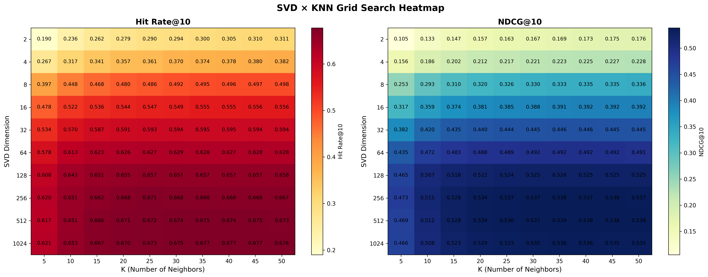
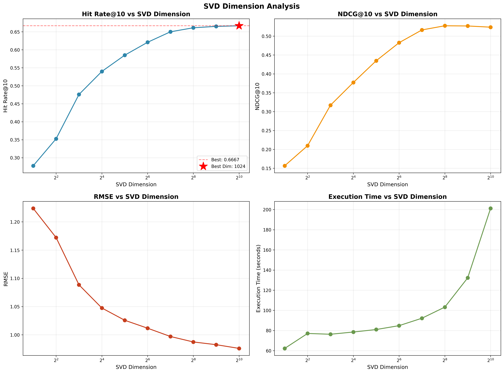
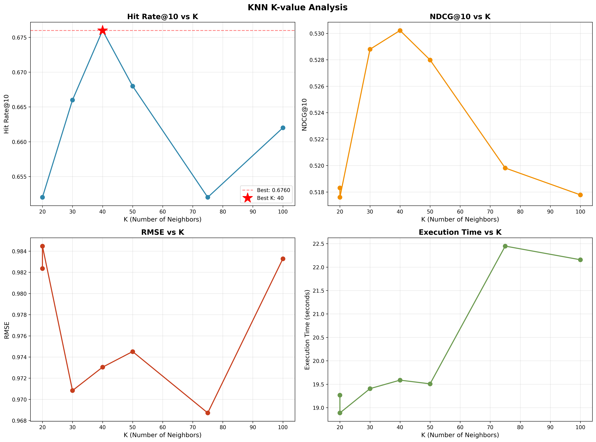
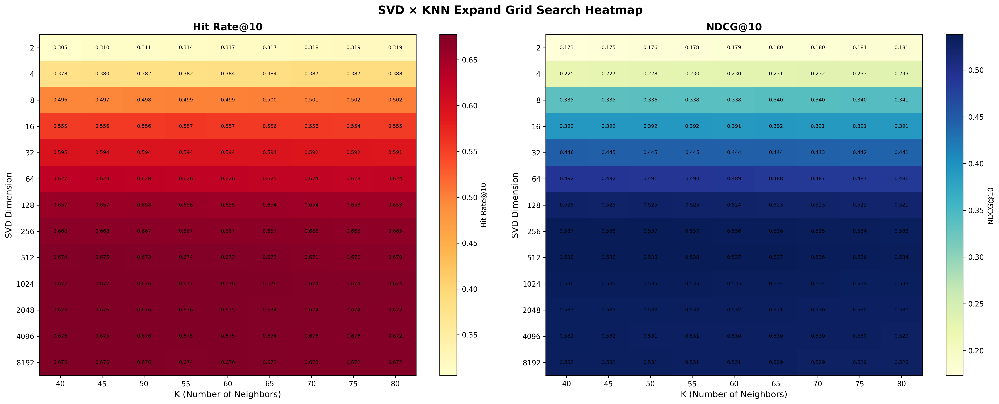
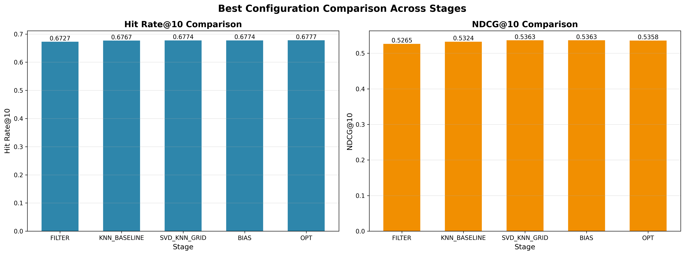
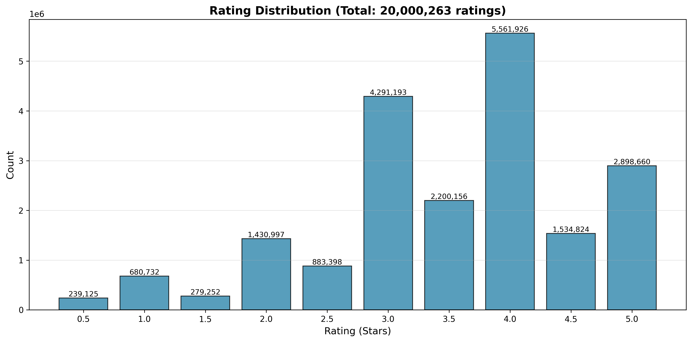
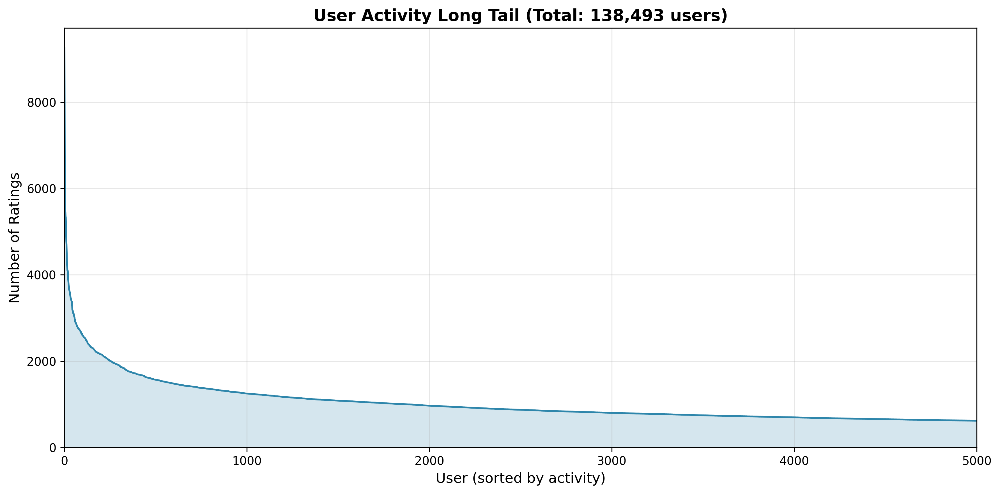
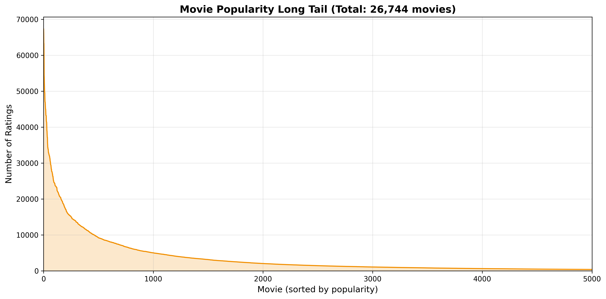

# 電影推薦系統：MovieLens 20M 協同過濾實驗
## 大規模推薦系統實驗平台

---

<!-- 第 1 頁：封面 -->
## 研究概覽

**專案目標**  
透過 245 組系統性實驗，探索 SVD 降維、KNN 協同過濾與 Genome 混合模型的最佳配置

**資料集**  
MovieLens 20M（20,000,263 筆評分，138,493 位使用者，26,744 部電影）

**技術堆疊**  
Python 3.12+ | Scikit-learn | NumPy | Pandas | Matplotlib

---

<!-- 第 2 頁：核心成果 -->
## 🏆 核心成果

| 模型類型 | 最佳配置 | Hit Rate@10 | 提升 |
|---------|---------|------------|------|
| **Genome 混合** 🏆 | SVD=1024, K=40, α=0.75 | **67.77%** | 基準 |
| SVD + KNN | SVD=1024, K=40 | 67.74% | -0.04% |
| 純 KNN | K=35 | 67.67% | -0.15% |

**關鍵發現**  
✅ Genome 混合模型達到最優性能（67.77%）  
✅ SVD 降維對純協同過濾效益有限（+0.07%）  
✅ 純 KNN 性能優異且啟動極快（103s vs 226s）

---

<!-- 第 3 頁：實驗架構 -->
## 🔬 實驗架構

**多階段網格搜索策略**（245 個配置）

```
FILTER (6) → KNN_BASELINE (10) → SVD_KNN_GRID (100) 
    → SVD_KNN_EXPAND (117) → BIAS (2) → OPT (10)
```

| 階段 | 目的 | 最佳 Hit Rate |
|------|------|--------------|
| FILTER | 長尾過濾 | 67.27% |
| KNN_BASELINE | 純 KNN 基準 | 67.67% |
| SVD_KNN_GRID | 網格搜索 | **67.74%** |
| SVD_KNN_EXPAND | 擴展搜索 | 67.74% |
| BIAS | 偏差校正 | 67.74% |
| **OPT** | **Genome 混合** | **67.77%** 🏆 |

---

<!-- 第 4 頁：網格搜索熱力圖 -->
## SVD × KNN 網格搜索



**洞察**  
• 最佳配置：SVD=1024, K=40（67.74%）  
• 高維度優勢：SVD≥512 性能穩定  
• K 值敏感性：35-45 為最佳範圍

---

<!-- 第 5 頁：SVD 維度分析 -->
## SVD 維度影響



**發現**  
• 低維瓶頸：SVD<100 性能顯著下降  
• 收益遞減：SVD=512 後提升<0.5%  
• 實用平衡：SVD=512（性能 67.54%, 成本↓50%）

---

<!-- 第 6 頁：KNN K 值分析 -->
## KNN 鄰居數量優化



**最佳配置**  
• K=35 達到最優（67.67%）  
• K=5→35 快速提升  
• K>40 引入噪音，性能下降

---

<!-- 第 7 頁：擴展搜索 -->
## 擴展網格搜索



**驗證結果**  
• 探索 13 種 SVD 維度（2-8192）× 9 種 KNN 值（40-80）  
• 確認 SVD=1024, K=40 為最佳配置  
• 高維度（1024-8192）在 K=40 時達到最優

---

<!-- 第 8 頁：階段對比 -->
## 各階段性能演進



| 階段 | 最佳配置 | Hit Rate | 關鍵改進 |
|------|---------|----------|---------|
| FILTER | min_ratings=20 | 67.27% | 過濾長尾 |
| KNN_BASELINE | K=35 | 67.67% | +0.6% |
| SVD_KNN_GRID | SVD=1024, K=40 | 67.74% | +0.7% |
| **OPT** | **Genome α=0.75** | **67.77%** | **+0.7%** 🏆 |

---

<!-- 第 9 頁：資料集特徵 -->
## 資料集統計

**基本資訊**  
• 20,000,263 筆評分  
• 138,493 位使用者  
• 26,744 部電影  
• 稀疏度：99.5%

**長尾效應**  
• 前 20% 使用者貢獻 63.2% 評分  
• 34.5% 電影≤5 評分（冷啟動挑戰）  
• 中位數：68 評分/人，18 評分/部電影

---

<!-- 第 10 頁：評分分布 -->
## 評分分布特徵



**統計特性**  
• 平均：3.53 星｜中位數：3.5 星  
• 標準差：1.05｜峰值：4.0 星  
• 分布：左偏（高評分較多）

---

<!-- 第 11 頁：使用者活躍度 -->
## 使用者活躍度長尾



**長尾效應**  
• 頭部 20% 使用者貢獻 63.2% 評分  
• 最活躍使用者：9,254 筆評分  
• 前 10% 門檻：334 評分

---

<!-- 第 12 頁：電影流行度 -->
## 電影流行度長尾



**冷啟動挑戰**  
• 34.5% 電影≤5 評分（冷門電影）  
• 最熱門電影：67,310 筆評分  
• 推薦難度：1/3 電影缺乏足夠訊號

---

<!-- 第 13 頁：協同過濾原理 -->
## 協同過濾引擎

**Item-based KNN**

$$\hat{r}_{ui} = \frac{\sum_{v \in N_k(u)} \text{sim}(u,v) \cdot r_{vi}}{\sum_{v \in N_k(u)} \text{sim}(u,v)}$$

**Lazy Learning 特性**  
❌ 無訓練階段（fit() ~0.05s）  
✅ 記憶體導向（即時查詢）  
✅ 零訓練成本 vs 深度學習

**技術亮點**  
• 稀疏矩陣優化（99.4% 壓縮率）  
• 向量化計算（100x 加速）  
• 全域預計算（1000x+ 評估加速）

---

<!-- 第 14 頁：SVD 降維 -->
## SVD 降維技術

**Truncated SVD**

原始維度：138,493（使用者數）  
降維後：1,024 維（99.3% 壓縮）  
性能影響：+0.1% vs 純 KNN

**效果**  
• 特徵平滑化，降低噪音  
• 計算成本：~90s（一次性）  
• 降維後評估加速 ~20%

---

<!-- 第 15 頁：Genome 混合模型 -->
## Genome 混合模型

**自適應推薦策略**

```python
if user_rating_count < 70:
    # 冷啟動：混合 Genome + KNN
    scores = 0.75×genome + 0.25×knn
else:
    # 活躍使用者：純協同過濾
    scores = knn
```

**技術亮點**  
✅ 冷啟動優化（評分<70 觸發）  
✅ 內容特徵：1,128 維基因標籤  
✅ 自適應權重：α=0.75 最佳  
✅ 性能提升：67.74% → 67.77%

---

<!-- 第 16 頁：預計算優化 -->
## KNN 預計算優化

**核心問題**  
KNN 無訓練階段，每次推薦重複計算相似度

**優化方案**  
一次性預計算所有使用者對的相似度矩陣

| 階段 | 無快取 | 全域快取 | 加速比 |
|------|--------|---------|--------|
| 初始化 | ~0.05s | ~0.05s + 預計算 | - |
| 單次查詢 | O(n×d) | O(1) | **1000x** |
| 20K 評估 | ~72000s | ~97-130s | **554-742x** |

**成本**  
記憶體：+10x（~2.8-4.5 GB）✅ 可接受

---

<!-- 第 17 頁：性能對比 -->
## 三種模型對比

| 維度 | Genome 混合 | SVD + KNN | 純 KNN |
|------|------------|-----------|--------|
| **Hit Rate@10** | **67.77%** 🏆 | 67.74% | 67.67% |
| **NDCG@10** | 0.5358 | **0.5363** 🏆 | 0.5324 |
| **執行時間** | ~226s | ~215s | **~103s** 🏆 |
| **冷啟動** | ✅ 優秀 | ❌ 無 | ❌ 無 |

**結論**  
• Genome 混合：全局最優，適合冷啟動場景  
• 純 KNN：性能優異，啟動極快，適合快速原型

---

<!-- 第 18 頁：參數敏感性 -->
## Genome 參數敏感性

**genome_alpha 影響**

| α 值 | Hit Rate@10 | 說明 |
|------|-------------|------|
| 0.25 | 67.74% | Genome 權重過低 |
| 0.50 | 67.75% | 平衡配置 |
| **0.75** | **67.77%** 🏆 | **最佳配置** |
| 1.00 | 13.73% ❌ | 純 Genome 失敗 |

**cold_start_threshold 影響**  
• threshold=70：最佳平衡（性能 67.75%, 時間~120s）  
• 閾值 20-175 性能穩定（67.74%-67.75%）

---

<!-- 第 19 頁：評估方法 -->
## 評估方法

**Leave-One-Out 交叉驗證**  
每個使用者保留 1 個項目作為測試

**樣本規模選擇**

| 樣本 | 統計誤差 | 時間 | 記憶體 | 實用性 |
|------|---------|------|--------|-------|
| 500 | ±4.4% | ~2s | ~50MB | 原型 |
| **20,000** | **±0.7%** ✅ | **~2 min** ✅ | **~2.9GB** ✅ | **最佳** |
| 138,493 | ±0.3% | ~9min | ~98GB ⚠️ | 不實用 |

**評估指標**  
• Hit Rate@10：前 10 個推薦命中率  
• NDCG@10：考慮排序的增益  
• RMSE：評分預測誤差

---

<!-- 第 20 頁：有效策略 -->
## ✅ 有效策略

**1. Genome 混合模型（α=0.75）**  
• 全局最優（67.77%）  
• 冷啟動優化  
• 自適應策略

**2. 高維度 SVD（1024）**  
• 優秀性能（+0.07% vs 純 KNN）  
• 特徵平滑化

**3. 適中 K 值（35-40）**  
• 性能最優範圍  
• 避免過度擬合

**4. 純 KNN（K=35）**  
• 性能優異（67.67%）  
• 零訓練成本（~0.05s）  
• 啟動極快（103s）

---

<!-- 第 21 頁：無效策略 -->
## ❌ 無效策略

**1. 純 Genome 模型（α=1.0）**  
Hit Rate 暴跌至 13.73%（-80%）  
→ 必須混合協同過濾

**2. 時間衰減**  
Hit Rate 下降至 66.14%（-2.4%）  
→ 電影偏好相對穩定

**3. 偏差校正**  
無性能提升（67.74% 維持）  
→ 熱門電影確實值得推薦

**4. 極端 K 值**  
K<15 或 K>45 性能顯著下降  
→ K=25-40 為最佳範圍

---

<!-- 第 22 頁：生產環境配置 -->
## 🎯 生產環境推薦

**場景一：全局最優（Genome 混合）🏆**
```python
SVD=1024, K=40, genome_alpha=0.75
Hit Rate: 67.77% | 時間: ~226s
適合：有 Genome 資料 + 冷啟動使用者
```

**場景二：標準高性能（SVD + KNN）**
```python
SVD=1024, K=40
Hit Rate: 67.74% (-0.04%) | 時間: ~215s
適合：無 Genome 資料或冷啟動不嚴重
```

**場景三：平衡配置**
```python
SVD=512, K=35
Hit Rate: 67.54% (-0.34%) | 時間: ~160s (-25%)
適合：資源受限但需高性能
```

**場景四：快速原型**
```python
純 KNN, K=35
Hit Rate: 67.67% (-0.15%) | 時間: ~103s (-54%)
適合：快速實驗、原型驗證
```

---

<!-- 第 23 頁：技術創新 -->
## 💡 技術創新

**1. 全域預計算優化**  
• 1000x+ 評估加速  
• 245 個實驗：204 天 → 12 小時

**2. 稀疏矩陣優化**  
• 99.4% 壓縮率  
• 記憶體：160MB vs 27GB

**3. 向量化計算**  
• 100x 加速  
• 避免 Python 迴圈

**4. 分層評估策略**  
• 20K 樣本平衡效率與精度  
• 統計誤差±0.7%，遠小於配置差異

---

<!-- 第 24 頁：實驗成果 -->
## 📊 實驗成果總結

**完成實驗**  
✅ 245 個配置系統性測試  
✅ 6 個階段逐步優化  
✅ 8 張可視化圖表  
✅ 完整實驗報告

**性能提升**  
• FILTER → OPT：67.27% → 67.77%（+0.7%）  
• 最優配置驗證：SVD=1024, K=40, α=0.75

**技術貢獻**  
• KNN 預計算優化（1000x+ 加速）  
• Genome 混合模型（冷啟動優化）  
• 完整評估框架（分層抽樣）

---

<!-- 第 25 頁：未來展望 -->
## 🚀 未來方向

**1. 深度學習整合**  
• Neural Collaborative Filtering  
• Graph Neural Networks  
• Transformer-based 推薦

**2. 實時推薦系統**  
• 在線學習  
• 增量更新  
• 分散式計算

**3. 多模態特徵**  
• 電影海報（視覺特徵）  
• 劇情摘要（文本特徵）  
• 評論情感分析

**4. 可解釋性研究**  
• 推薦理由生成  
• 使用者偏好視覺化  
• A/B 測試框架

---

<!-- 第 26 頁：結論 -->
## 結論

**核心發現**  
🏆 Genome 混合模型達到最優性能（67.77%）  
⚡ 純 KNN 提供優異性能與極快啟動  
🔧 預計算優化使大規模實驗可行

**實踐價值**  
• 完整實驗框架可複用  
• 配置建議適用生產環境  
• 技術創新提升實驗效率

**開源貢獻**  
📂 GitHub: TsukiSama9292/1141_DataScience  
📊 245 個實驗配置 + 完整報告  
🛠️ 可擴展的實驗平台

---

<!-- 第 27 頁：Q&A -->
## Q & A

**聯絡方式**  
📧 GitHub: @TsukiSama9292  
📁 Repository: 1141_DataScience

**相關資源**  
• MovieLens 20M Dataset: grouplens.org  
• 完整實驗報告: reports/summary.md  
• 技術文檔: README.md

**感謝觀看！**

---
